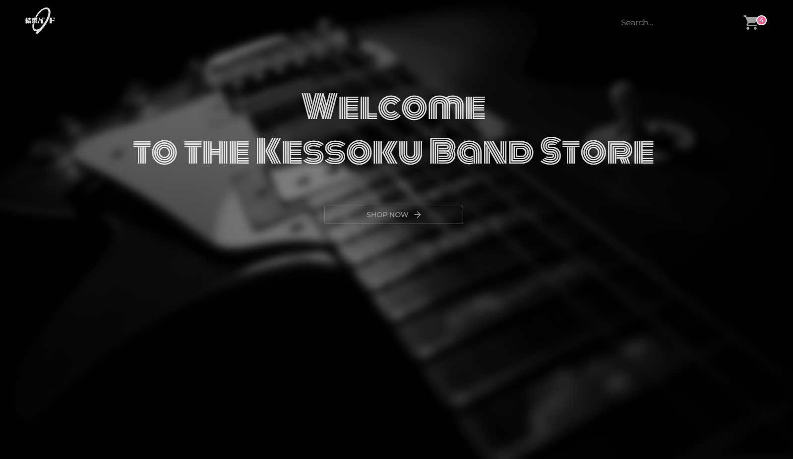
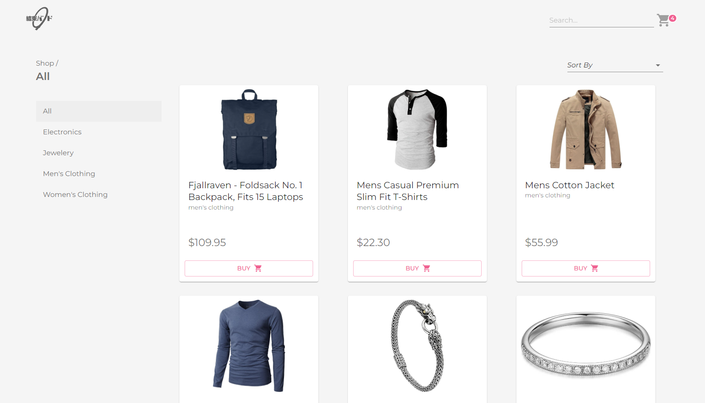

# shopping-cart

<h3 align="center"><a href="https://shopping-cart-blue-psi.vercel.app/">DEMO</a></h2>

## About the project

The last project in The Odin Project's React course and my biggest so far. Here I've tryed to use everything I've learned and the new tools I've been learning while doing this project. Hope you like it :)

## Features

- Responsive design
- Swipeable cart
- Cart is accessible from any page
- Cart badge show number of products inside
- Same products in the cart are merging into one
- Sorting products by price
- Sorting products by category
- Product gallery
- Cart is saving to local storage

## Built with

- TypeScript
- React
- Redux/Toolkit
- MUI
- Sass
- Vite
- Swiper library
- Axios library

## Comment

Search bar is not implemented yet but I will definitely do it in the nearest future.
